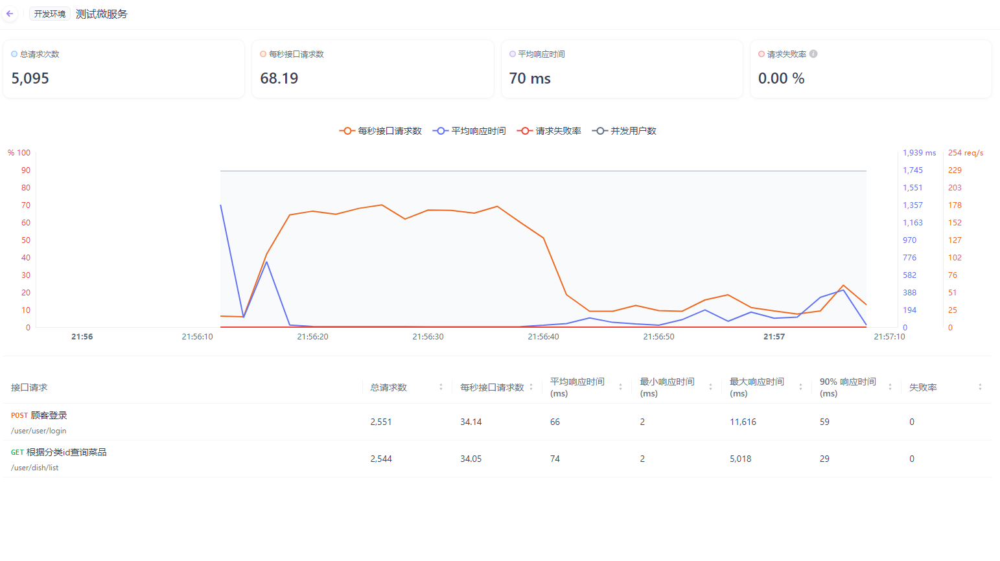
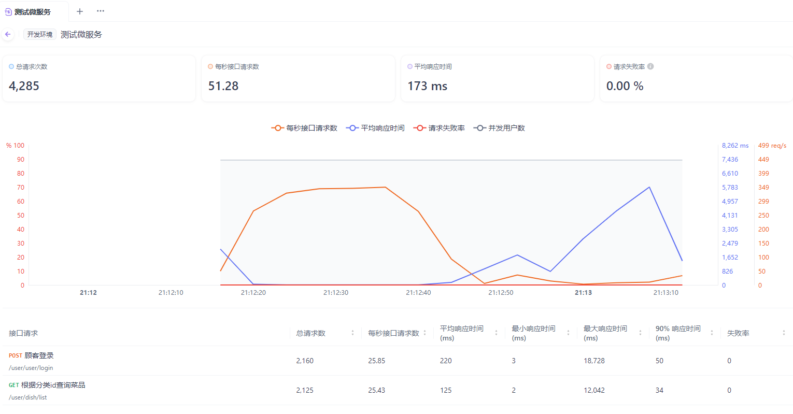

# Project-of-sky-take-out( **micro-service Architecture** )

把外卖平台的单体架构改为微服务架构。
相关的更详细的文档：https://fcneheqzlq8n.feishu.cn/wiki/ZKlXwNEAmi2AVOkUTkRcCfSjnng

- 2025-3-1 将Redis一级缓存改为Redis+Caffeine二级缓存，从而将接口“**用户根据分类id查询菜品（连带口味）**”的qps和平均响应时间进行优化。

二级缓存下：

只用Redis时：

可以看出，Redis缓存改为二级缓存后，qps提高了36%，平均响应时间减少了40%（从原来的125ms变为74ms)。

- 2025-3-4 修复SpringCache集成Caffeine后的错误，并且初步使用Nacos，成功拆分店铺模块（`item-service`)，已验证过部分接口证明拆分成功。
- 2025-3-5 拆分用户端基础功能模块（user-service)