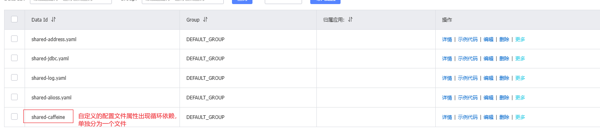

# Project-of-sky-take-out( **Microservice Architecture** )

把双端（B端和C端）的外卖平台的单体架构改为微服务架构。
相关的更详细的文档：https://fcneheqzlq8n.feishu.cn/wiki/ZKlXwNEAmi2AVOkUTkRcCfSjnng

- 2025-3-1 将Redis一级缓存改为Redis+Caffeine二级缓存，从而将接口“**用户根据分类id查询菜品（连带口味）**”的qps和平均响应时间进行优化。

二级缓存下：

只用Redis时：

可以看出，Redis缓存改为二级缓存后，qps提高了36%，平均响应时间减少了40%（从原来的125ms变为74ms)。

- 2025-3-4 修复SpringCache集成Caffeine后的错误，并且初步使用Nacos，成功拆分得到店铺模块（`item-service`)，已验证过部分接口证明拆分成功。
- 2025-3-5 拆分得到用户端基础功能模块（`user-service`)
- 2025-3-7 成功拆分得到管理员端功能模块（`admin-service`)，直接配置多个数据源从而访问其他服务用到的数据库。
- 2025-3-9 成功拆分得到购物车模块(`cart-service`)和订货模块(`order-service`)。
至此，5个服务模块可以正常同时启动,但是没有设置互相访问时传递的token。
- 2025-3-11 加入filter的路由功能和替换连接池。并成功联调不同的微服务，包括网关转发给一个微服务以及微服务之间的互相调用。
- 2025-3-12 在Nacos注册中心添加和拉取共享配置以简化`.yml`文件的编写。共享配置的设置如下图所示：

并配置普通属性的热更新和动态路由的热更新,部分图如下:

